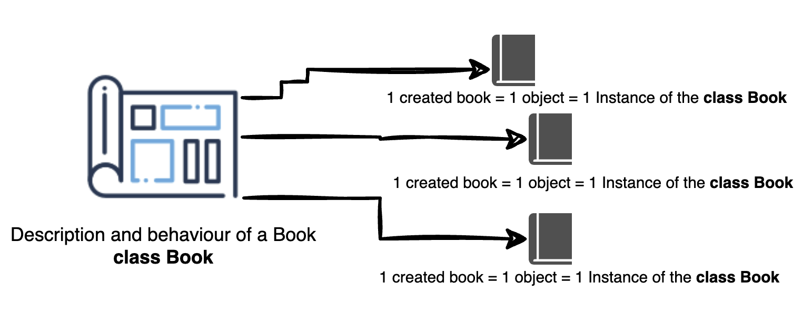

# Classes

## Materials & Resources

### Video materials to be watched before the class

| Material                                                                    | Author          |         Time |
|:----------------------------------------------------------------------------|-----------------|-------------:|
| [Class and Object Theory](https://youtu.be/Znmz_WxMxp4?si=q1H_d-RBA9udk7TB) | Telusko         |        05:47 |
| [Java Classes & Objects](https://youtu.be/IUqKuGNasdM?si=tAQmxKzMyvzg1TOB)  | Keep on Coding  |        11:35 |
| [Classes & Objects](https://youtu.be/Mm06BuD3PlY?si=zalfU2mwtKaLBnlj)       | Giraffe Academy |        13:51 |
| -                                                                           | **Total**       | **~30 mins** |

### Theory

#### What problem `class` solves?

Basic data types in Java include `int`, `double`, `char`, and `boolean`.
While these are fundamental, the complexity of real-world scenarios often extends beyond such elementary values.
For instance, consider the task of managing a library's collection of books.
In this context, a book is characterized by various attributes, such as its title,
author, publisher, price, and ISBN number. These attributes collectively define a book, but they cannot be adequately
represented using only the basic data types like `int` or `char`.

To effectively represent, for example, a book (or any object from the real-world)
in a software application, a more comprehensive data structure is needed.
This requirement leads to the creation of a new type, known as a `class`, in Java.
A `class` is a custom data type that encapsulates all the necessary attributes like
title, author, and price and behaviors associated with a
book, thereby providing a more accurate and useful representation in the context of the application.

#### What is a class?

A class is a blueprint or template for creating objects.
In the example the `class` will be `Book` a new data type, what the developer can create.
One instance of a `Book` class will be one specified book,
like one book of `The Lord of the Rings` or `Harry Potter and the Philosopher's Stone` or any other books.



#### How to create a simple class?

We need to create a new file with the name of the class and the `.java` extension.
> [!IMPORTANT]
> The name of the file should be the same as the name of the class.

The name of the class should begin with a capital letter and follow the Upper CamelCase (also known as Pascal Case)
naming convention.
The following code snippet illustrates the syntax of a class declaration.

Let's create a new file called `Book.java` and write the following code into it:

```java
class Book {
    // class body, attributes and methods will be here
}
```

A class is created using the `class` keyword followed by the name of the class which is `Book` for now.
The name of the class should begin with a capital letter and follow the Upper CamelCase (also known as Pascal Case)
naming convention
therefore the name of the class is `Book`.
The body of the class is enclosed within a pair of curly braces `{}`.
In the body of the class, we can define the attributes and behaviors (methods) of the class.

#### Class name naming conventions

- **Case**: Upper CamelCase (Pascal case)

> [!NOTE]
> Upper CamelCase (Pascal case) is a naming convention in which the first letter of each word in a compound word is
> capitalized. For example: AudioSystem

- **No Spaces or Underscores**: There are no spaces or underscores between words. Each word is directly connected to the
  next, with their boundary indicated by a capital letter.
- **Descriptive and Intuitive**: Class names should be nouns and are often descriptive of what the class represents. For
  example: `Book`, `Car`, `Person`, `Student`, `Employee`, `Customer`, `Account`, `Bank`, `Library`, `School`, etc.
- **Singular Form**: Generally, class names are in singular form, unless they specifically represent a collection of
  items. If a class represents a collection or list of items, then the name of the class should be in plural form.

#### How can we create an instance of a class?

The instance of a class is called an **object**, which represents a real-world entity.
We can create a book in any method, but for now, we will create it in the `main` method.

Let's create a new file called `Main.java` beside the `Book.java` file
and write the following code into it:

```java
public class Main {
    public static void main(String[] args) {
        Book book = new Book();
    }
}
```

An instance of a class is created using the `new` keyword followed by the name of the class.
The syntax for creating an instance of a class is similar to that of invoking a method.
The `new` keyword is followed by the name of the class, followed by a pair of parentheses `()`.
Like methods, the parentheses are followed by a semicolon `;`.

In this case the book does not have any attributes like title, author, and price.
We will add them in the next section: [Fields](../fields-properties-attributes/README.md).

## Quiz

### Question 1: What are the primitive data types in Java from the following options?

- A) Class, Object, Array
- B) int, double, char, boolean
- C) String, int, boolean, HashMap
- D) Book, Class, int

### Question 2: Why can't real-world entities like books be adequately represented using only primitive data types in Java?

- A) Because real-world entities are too complex to be represented using primitive data types
- B) Java does not support primitive data types
- C) Primitive data types are only for numerical calculations
- D) Primitive data types can represent any real-world entity

### Question 3: What is a class in Java?

- A) A function
- B) A template for creating objects
- C) A method to execute code
- D) A group of primitive data types

### Question 4: In the context of Java, what does an **instance** of a class represent?

- A) A specific version of a program
- B) An error in the code
- C) A real-world entity
- D) A type of data structure

### Question 5: How is an instance of a class created in Java?

- A) Using the instance keyword
- B) By calling any function
- C) Using the new keyword followed by the class name
- D) By importing the class from another file or package or library or module

### Question 6: What should be the relationship between the name of a Java class and the filename in which it is declared?

- A) The names can be different
- B) The filename should be in lowercase
- C) The class name and filename should be the same
- D) The filename should have a special character prefix

### Question 7: Which of the following statements about a Java class is NOT true?

- A) A class can contain methods and behaviors
- B) A class must have at least one method
- C) A class is a blueprint for objects
- D) The class name should begin with a capital letter

### Answers:

1. Question: What are the primitive data types in Java from the following options?

- B) int, double, char, boolean

2. Question: Why can't real-world entities like books be adequately represented using only primitive data types in Java?

- A) Because real-world entities are too complex to be represented using primitive data types

3. Question: What is a class in Java?

- B) A template for creating objects

4. Question: In the context of Java, what does an instance of a class represent?

- C) A real-world entity

5. Question: How is an instance of a class created in Java?

- C) Using the new keyword followed by the class name

6. Question: What should be the relationship between the name of a Java class and the filename in which it is declared?

- C) The class name and filename should be the same

7. Question: Which of the following statements about a Java class is NOT true?

- B) A class must have at least one method (Classes can exist without explicit methods) 
